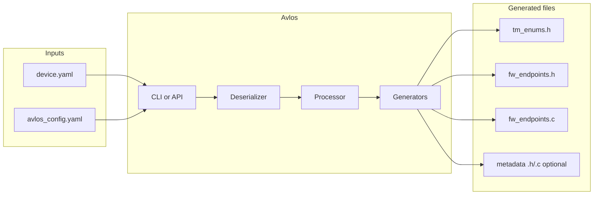
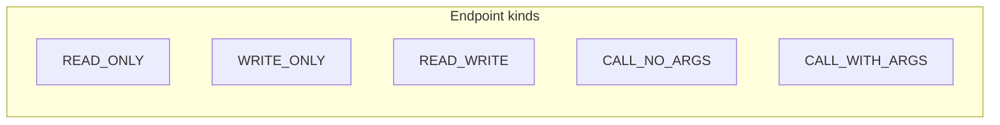

# Avlos architecture

This document describes the structure and data flow of Avlos. For contributor and AI guidance, see [AGENTS.md](AGENTS.md).

## High-level flow

1. **Input**: A device spec YAML file and an Avlos config file (`avlos_config.yaml`).
2. **CLI or API**: The CLI (`avlos from file <spec>`) or programmatic use loads the YAML and calls the processor. See [avlos/cli.py](avlos/cli.py) and [avlos/processor.py](avlos/processor.py).
3. **Processor** ([avlos/processor.py](avlos/processor.py)): Loads the config, resolves all paths to absolute (relative to the config file directory), then calls each enabled generator’s `process(instance, module_config)`.
4. **Deserializer** ([avlos/deserializer.py](avlos/deserializer.py)): Builds the in-memory object tree via `RootNodeSchema`. The schema in [avlos/definitions/remote_node.py](avlos/definitions/remote_node.py) (`RemoteNodeSchema.post_load`) decides whether each node is a RemoteNode, RemoteFunction, RemoteAttribute, RemoteBitmask, or RemoteEnum, and assigns `ep_id` via [avlos/counter.py](avlos/counter.py).
5. **Generators**: Each generator receives the same `instance` (root of the tree). The C generator uses `avlos_endpoints(instance)` to get one flat list of endpoints; templates iterate that list to produce the enums header, endpoints header, endpoints implementation, and optionally the endpoint metadata files.

## Object model

- **RootNode** ([avlos/definitions/remote_root_node.py](avlos/definitions/remote_root_node.py)): Root of the tree; extends RemoteNode.
- **RemoteNode** ([avlos/definitions/remote_node.py](avlos/definitions/remote_node.py)): Interior node with `remote_attributes` (ordered dict of children). Can contain more RemoteNodes or endpoint leaves.
- **Endpoint leaves** (same schema, different `post_load` result):
  - **RemoteAttribute**: Has `dtype`, `getter_name`, `setter_name`. Used for read/write values.
  - **RemoteFunction**: Has `caller_name`, `arguments` (list of name + dtype), `dtype` (return type).
  - **RemoteEnum**: Has `options` (enum); exposes `dtype` as UINT8.
  - **RemoteBitmask**: Has `flags` (bitmask); exposes `dtype` as UINT8.

All endpoints have `ep_id`, `endpoint_function_name`, and a `dtype` (or equivalent). The **canonical traversal order** is given by `avlos_endpoints(root)` in [avlos/generators/filters.py](avlos/generators/filters.py): depth-first over `remote_attributes`, collecting any node that has `getter_name`, `setter_name`, or `caller_name`.

### Endpoint kind (for metadata)

When generating endpoint metadata, each endpoint is classified into one of:

| Condition | Avlos_EndpointKind |
|-----------|---------------------|
| getter only, no setter, no caller | READ_ONLY |
| setter only, no getter, no caller | WRITE_ONLY |
| getter + setter, no caller | READ_WRITE |
| caller, `arguments` empty | CALL_NO_ARGS |
| caller, `arguments` non-empty | CALL_WITH_ARGS |

## C generator in detail

- **Required paths**: `output_enums`, `output_header`, `output_impl`. See [avlos/generators/generator_c.py](avlos/generators/generator_c.py).
- **Optional paths** (when both present, metadata is generated): `output_metadata_header`, `output_metadata_impl`.
- **Templates**: `tm_enums.h.jinja`, `fw_endpoints.h.jinja`, `fw_endpoints.c.jinja`, and optionally `avlos_endpoint_metadata.h.jinja`, `avlos_endpoint_metadata.c.jinja`.
- **Filters** (registered in `process()`): `endpoints`, `enum_eps`, `bitmask_eps`, `as_include`, and for metadata `avlos_ep_kind`, `avlos_metadata_dtype`. The endpoint list is identical for header, implementation, and metadata.

## Config and paths

Config is per generator under `generators.<name>`. Paths are relative to the directory containing the config file; the processor converts them to absolute before calling the generator. New outputs (e.g. metadata) are added as new optional path keys; the C generator only generates metadata when both `output_metadata_header` and `output_metadata_impl` are set.
